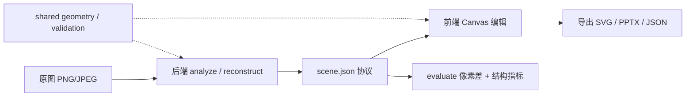

# Scientific Drawing

把论文截图、流程图或模块图，转成一份可编辑的 `scene.json`，再导出为 SVG / PPTX / JSON 的本地研究型工具。

## Why

主流绘图工具要么追求像素还原（截图、贴图），要么追求纯语义结构（mermaid、graphviz），两者很难兼得：一次性的纯语义重建在论文图上极不稳定，而纯位图又彻底失去可编辑性。

本项目的取舍是**复刻优先 + 协议中介**：先把原图作为锁定底图，保证视觉不跑偏；再用启发式或 AI 在上方叠加可编辑节点层，让用户逐步修正或替换。中间的 `scene.json` 是唯一事实源，Canvas、SVG、PPTX 共享同一套几何与颜色规则，三个出口视觉一致。

## Quick start

```bash
npm install
npm run dev      # 同启前端 5173 + 后端 8787
# 浏览器打开 http://localhost:5173
```

可选：配置 AI 重建（未配置时启发式分析、编辑与导出依旧可用）。两种方式二选一：

**方式 A：UI 配置（推荐，热生效无需重启）**

启动后点击右上角齿轮按钮 → 填写 API Key / Base URL / 模型 → 测试连接 → 保存。配置写入
`data/config.json`（仅服务端持有，文件权限 `0o600`），下次 AI 调用立即生效。
首次未配置时打开页面会自动弹出该对话框。点对话框里的「清空 / 回退 env」可回到环境变量。

**方式 B：环境变量（适合 CI / 容器编排）**

```bash
export OPENAI_API_KEY="your-key"
export OPENAI_RECONSTRUCT_MODEL="gpt-4o"    # 兜底模型
npm run dev
```

`data/config.json` 一旦存在即覆盖 env；删掉文件即可回退。

常用脚本：

- `npm run typecheck`：`tsc --noEmit`，全仓 TypeScript 检查
- `npm test`：`tsx --test tests/**/*.test.ts`，跑回归用例
- `npm run evaluate`：`tsx server/src/evaluate.ts`，跑 `data/eval-suite/manifest.json` 中的固定样本评估
- `npm run build`：`tsc -b && vite build`，前端生产构建
- `npm run server:start` / `npm run client:dev`：单独拉起后端或前端

需要 Node.js ^20.19.0 或 >=22.12.0。CI（`.github/workflows/ci.yml`）会跑 `npm ci`、`typecheck`、`test`、`build` 与 `evaluate`，并对评估指标做严格 delta 门禁。

## Docker 部署

单机自部署（VPS / 内网 Linux），用容器同时锁定字体环境：

```bash
cp .env.example .env          # 编辑 .env，按需填入 OPENAI_API_KEY（可选）
docker compose up -d          # 首次会自动 build
# 浏览器打开 http://<host>:8787
```

详细部署、反代示例、备份策略见 [docs/DEPLOYMENT.md](docs/DEPLOYMENT.md)。

## How it works



流水线只有四步：图像进入后端走启发式或 AI 两条支路，统一落到 `scene.json`；前端在画布上编辑同一份协议；导出器与评估脚本都基于这份协议工作，保证三处视觉一致并可量化对比。`shared/` 目录里的类型、运行时校验与几何工具是前后端共同依赖，避免双份实现漂移。

典型迭代节奏：上传论文图 → 优先走启发式分析得到锁定底图 + 辅助框 → 局部不准的区域走 AI 重建覆盖 → 在画布手工微调 → 导出 SVG / PPTX / JSON → 用 `npm run evaluate` 对比基线，看像素差和结构指标是否回退。

## Highlights

- **双路径重建**：sharp 启发式分析负责快速复刻 + 锁定底图；OpenAI Responses 多模态重建负责语义节点与连线。两条支路最终都过同一条 `repairScene` 修复链路。
- **现代化编辑器界面**：SciDraw 风格五区布局（顶栏 + 工具侧栏 + 画布 + 属性面板 + 底部 AI 矢量化抽屉），右栏三 tab（样式 / 属性 / 排列），9 个内置 + 最多 12 个自定义快速样式（localStorage 持久化），画布上方可切原图 / 矢量化结果视图，选中节点底部浮出复制 / 锁定 / 删除浮动操作条。
- **scene.json 作为协议中介**：前后端共享同一份类型与运行时校验（`src/shared/scene.ts` / `sceneValidation.ts`），Canvas、SVG、PPTX 三个渲染器共用 `geometry.ts`，导入失败不会污染当前画布。
- **确定性输出 + CI 门禁**：`analyzeImage` 走确定性路径；`npm run evaluate` 输出 `meanDiff` / `psnr` / `ssim` 并与 `data/eval-suite/baseline.json` 比对，CI 跑严格 delta 阈值，回归即拦。
- **运行产物自治**：后端启动时按 `DATA_RETENTION_DAYS` 清理 `data/uploads`、`data/exports`、`data/scenes`，只动已知后缀，不递归删目录。
- **本地优先**：所有数据落在 `data/`，OpenAI Key 只在后端持有，前端通过 `/api/config` 只拿到模型列表。

## Roadmap

- OCR：识别真实文字以替换启发式生成的默认 Text 占位
- 箭头检测：让普通分析稳定输出 `arrow` edges
- AI 链路评估：补 AI 重建路径的结构与视觉双指标
- 差异闭环：导出 SVG 后反渲染，与原图自动对比定位差异
- 视觉回归阈值化：把 `normalizedMeanDiff` / `ssimDelta` 接入更细粒度的测试断言
- 撤销粒度细化：拆开拖拽、缩放、批量操作各自的历史栈
- 阴影协议接入：scene.style 加 shadow 字段并接通 svg/pptx 渲染（当前 StyleTab 占位）

## Status

仓库处于 `scientific-drawing-hardening` 分支，已完成的硬化方向：协议深校验、渲染一致性、AI 输出修复、文件治理、评估指标自动回归（CI 跑 evaluate + 严格 delta 门禁）、`analyzeImage` 确定性输出、`docker-compose` 单机部署、AI 配置可视化与持久化、编辑器界面全面重做（详见 Highlights）。`private: true`，未发布到 npm，也未配置远端，可通过 Docker 单机自部署到 VPS / 内网。

## License

MIT，详见 [LICENSE](./LICENSE)。

## More

技术细节、scene.json 协议表、HTTP API 全表、评估公式、目录树与 FAQ 见 [docs/ARCHITECTURE.md](./docs/ARCHITECTURE.md)。
