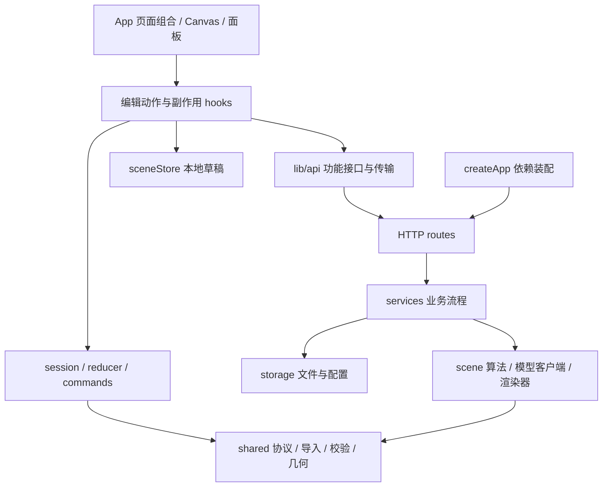

# Scientific Drawing — Architecture & Reference

本文档是主 README 的技术补充，详尽记录协议、API 与评估管线。

## 目录

1. [设计目标与系统架构](#1-设计目标与系统架构)
2. [scene.json 协议](#2-scenejson-协议)
3. [推荐工作流](#3-推荐工作流)
4. [HTTP API](#4-http-api)
5. [Visiomaster 风格导入](#5-visiomaster-风格导入)
6. [评估体系](#6-评估体系)
7. [开发命令与目录结构](#7-开发命令与目录结构)
8. [常见问题](#8-常见问题)

---

## 1. 设计目标与系统架构

### 1.1 问题与设计目标

复刻一张论文图通常面对两个互相矛盾的目标：

- **视觉保真**：颜色、版式、字体、箭头细节要尽量接近原图；
- **可编辑性**：节点、连线、文字需要在导出后还能在 PPT 或 SVG 编辑器里二次修改。

本项目用一个统一的中间表示 `scene.json` 把这两条目标解耦：

$$
\text{Image} \xrightarrow{\text{analyze} / \text{reconstruct}} \mathcal{S} \xrightarrow{\text{edit}} \mathcal{S}' \xrightarrow{\text{export}} \{\text{SVG}, \text{PPTX}, \text{JSON}\}
$$

其中 $\mathcal{S}$ 是 scene 协议，所有渲染器（Canvas / SVG / PPTX）共享同一套几何与颜色规则（`src/shared/geometry.ts`），减少三个出口的几何与颜色差异；字体与文本布局仍由各渲染引擎处理。

### 1.2 两条重建支路

| 入口 | 技术 | 适合场景 |
| --- | --- | --- |
| 普通分析 | sharp + 连通域 + 启发式 | 复刻原图、再手工修 |
| AI 重建 | OpenAI Responses 多模态 | 强结构化、语义编辑 |

两条路径**最终都落到同一个 scene 协议**，并经过同一条修复链路 (`repairScene`) 收敛：补 metadata、去重 id、规范颜色、夹紧尺寸、丢掉悬空连线、自动插入锁定原图底图。

### 1.3 当前模块边界

2026-09-09 重构保留 React、Express、TypeScript 和 scene 0.1 协议。历史硬化方案见 `docs/superpowers/plans/`，此次实施证据见 [实施记录](plans/2026-09-09-refactoring-results.md)。



`shared` 不依赖 React、浏览器存储、Node 或服务端。编辑模型不执行 HTTP 或存储副作用；服务与存储不反向依赖路由。`npm run check:boundaries` 使用 TypeScript 实际解析结果检查这些约束，支持相对路径与别名。

### 1.4 编辑会话与任务生命周期

`model/session.ts` 持有纯 reducer 状态，React 用 `useSyncExternalStore` 订阅。同步命令入口使同一事件内的两次任务申请也遵守互斥。文档历史、选择、工具、视口、交互预览与当前任务由同一状态机转换。

- 一次批量操作提交一个撤销点。拖拽/resize 的预览保留交互前快照，结束时提交，取消时恢复；无变化不创建历史。
- 分析、导入、整图/局部重建和导出期间暂停内容修改，保留视图、平移缩放与取消。组件禁用与命令层守卫共同执行规则。
- 任务携带 `id`、`documentId`、`revision`；只有仍有效的任务结果可提交。AbortController 传递取消信号，任务 runner 同时阻止无法取消的迟到回调更新状态。
- `useScenePersistence` 负责 800ms 去抖与离页保护；仅存储返回 `ok` 才记为已保存，内存回退和清理失败仍提示未保存。
- `useWorkspaceSettings` 负责能力配置和弹窗顺序；保存/清空共享同步写锁，避免重叠请求颠倒最终配置。

### 1.5 服务装配与存储

`createApp(options)` 只装配 Express 和路由，不监听端口、不运行保留策略，也不因为 Multer 初始化而创建上传目录。`index.ts` 负责生产目录初始化、清理、监听及关闭。测试注入临时 `paths`、模型调用、文件操作与配置环境。

路由处理 HTTP 参数、上传限制、Origin 和错误响应；services 处理修复校验、裁剪合并和导出流程；storage 处理路径、场景与配置读写。场景保存采用同目录唯一临时文件再 rename，失败清理临时文件并保留此前有效版本。请求断开会将取消信号传入模型调用，并阻止迟到结果持久化。

---

## 2. scene.json 协议

`scene.json` 是项目的核心协议，前后端共享 `src/shared/scene.ts`，运行时由 `validateScene` 检查、由 `repairScene` 修复。

### 2.1 根结构

```json
{
  "version": "0.1",
  "page": {
    "width": 1280,
    "height": 720,
    "background": "#FFFFFF",
    "units": "px"
  },
  "metadata": {
    "id": "scene-id",
    "title": "Scientific Figure",
    "sourceImage": "/uploads/example.png",
    "createdAt": "2026-05-17T00:00:00.000Z",
    "engine": "scientific-drawing",
    "notes": []
  },
  "nodes": [],
  "edges": []
}
```

### 2.2 节点类型

| `type` | 含义 |
| --- | --- |
| `text` | 文本 |
| `rect` | 矩形 |
| `rounded_rect` | 圆角矩形 |
| `ellipse` | 椭圆 |
| `line` | 折线 |
| `arrow` | 带箭头的折线 |
| `image` | 图片（可设 `locked: true`） |
| `grid` | 规则网格 |
| `feature_grid` | 特征图 / 热力图网格 |
| `bracket` | 分组括号 |
| `operator` | 圆形算子或符号 |

通用字段：

```json
{
  "id": "node-id",
  "type": "rect",
  "x": 10, "y": 20, "w": 120, "h": 60,
  "text": "Label",
  "style": {
    "fill": "#FFFFFF",
    "stroke": "#111111",
    "strokeWidth": 1,
    "fontFamily": "Times New Roman",
    "fontSize": 16,
    "fontWeight": "400",
    "color": "#111111",
    "opacity": 1,
    "dash": "7 5"
  },
  "locked": false,
  "hidden": false
}
```

`locked` 会禁止画布拖拽和框选编辑；`hidden` 会让节点不参与画布、SVG 和 PPTX 渲染。引用隐藏节点的语义连线也会被隐藏。

### 2.3 网格

`grid` 与 `feature_grid` 支持行色、列阴影和单元格自定义：

```json
{
  "id": "blocks", "type": "grid",
  "x": 100, "y": 100, "w": 300, "h": 50,
  "rows": 1, "cols": 6,
  "rowColors": ["#FFFFFF"],
  "columnShades": [0, 0, 0, 0, 0, 0],
  "cells": [
    { "row": 0, "col": 0, "fill": "#60A5FA", "text": "1" },
    { "row": 0, "col": 1, "fill": "#86EFAC", "text": "2" }
  ],
  "style": { "stroke": "#111111", "strokeWidth": 1, "fontSize": 18 }
}
```

### 2.4 连线

```json
{
  "id": "edge-1",
  "type": "arrow",
  "from": "source-node:right@0.5",
  "to":   "target-node:left@0.5",
  "points": [{ "x": 400, "y": 120 }, { "x": 520, "y": 120 }],
  "style": { "stroke": "#111111", "strokeWidth": 2 }
}
```

- `type`: `arrow | line | join | fork`
- 端点格式：`node-id:left|right|top|bottom@ratio`，`ratio ∈ [0, 1]`
- 若提供 `fromPoint` / `toPoint`，优先使用显式坐标

### 2.5 校验与修复

导入规则集中在 `src/shared/sceneImport.ts`。前后端 `visiomasterAdapter.ts` 只注入 ID、时间、标题、engine 和 notes 等来源默认值。识别使用整体节点词汇和显式元数据，兼容约定的旧草稿，拒绝未知版本及混合格式，错误包含可定位字段路径。

```text
导入 / 模型输出 → 格式识别与转换 → repairScene → assertScene
待服务端持久化 → repairScene → 固定 id/sourceImage → 补锁定底图 → validateScene
导出请求 → validateScene → SVG / PPTX / JSON
```

导出保持严格校验，不先静默修复非法输入。失败场景不会替换当前画布。错误响应按入口保留原有字符串或结构化格式，客户端统一兼容解析；静态类型不能代替运行时校验。

---

## 3. 推荐工作流

### 3.1 主流程

```text
1. 上传论文图
2. 优先尝试「普通分析」，得到锁定底图 + 辅助框
3. 如需结构化，使用「AI 重建」
4. 在画布拖动节点、改文字、调颜色
5. 导出 SVG / PPTX / JSON
6. 用 npm run evaluate 检查视觉与结构指标
```

### 3.2 两种重建模式

| 模式 | 特点 | 适合场景 |
| --- | --- | --- |
| 普通分析 | 保留底图 + 启发式辅助框，**评估覆盖** | 快速复刻、手工细修 |
| AI 重建  | 生成语义节点和连线，**自动叠加锁定底图** | 二次设计、结构编辑 |

> AI 重建后底图依旧锁定在最底层，最终视觉接近原图；AI 节点作为覆盖层存在，可逐步删除底图或调透明度，留下纯语义图元。

### 3.3 画布编辑能力

| 操作 | 说明 |
| --- | --- |
| 框选 / 多选 | 空白处拖拽选择多个对象 |
| 移动 | 拖动任一选中对象批量移动 |
| 缩放 | 选中后拖动蓝色八方向手柄 |
| 线条端点 | 拖动折线 / 箭头两个端点 |
| 语义连线 | 选连线工具，点起止节点 |
| 局部 AI 重建 | 选局部重建工具，框选区域后选择替换或叠加 |
| 图层面板 | 左侧图层页选择对象，切换显示/锁定，上移或下移 |
| 视图缩放 | `Ctrl` + 滚轮（0.25× ~ 4×） |
| 视图平移 | 中键拖拽，或 `空格` + 左键拖拽 |
| 重置视图 | 顶栏「更多操作」中的重置视图 |
| 删除 | `Delete` / `Backspace` |
| 复制 | `Ctrl+D` / `Cmd+D` |
| 撤销 | `Ctrl+Z` / `Cmd+Z` |
| 重做 | `Ctrl+Y` / `Cmd+Shift+Z` |
| 取消 | `Escape` |

锁定的源图底图不会被框选误选中。

---

## 4. HTTP API

后端默认监听 `http://localhost:8787`，静态资源挂载在 `/uploads` 与 `/exports`。

### `GET /api/config`

```json
{
  "aiReconstructionAvailable": true,
  "provider": "openai-compatible",
  "baseUrl": "https://api.openai.com/v1",
  "reconstructModel": "gpt-4o",
  "reconstructModels": ["gpt-4o", "gpt-4o-mini"],
  "modelListAvailable": true,
  "modelListError": null
}
```

### 配置写入与连通性检查

`POST /api/config` 接收 `WritableAppConfig`，成功返回不含原始密钥的 `AppConfig`；`DELETE /api/config` 清除 UI 文件并返回环境变量回退后的能力配置。`POST /api/config/test` 使用表单配置测试模型列表，返回 `TestConfigResult`，不保存配置。具体字段与错误码集中在 `src/shared/apiContracts.ts`；`AppConfig` 还包含 `hasApiKey`、`source` 和 `maskedTail`。

### `POST /api/analyze`

启发式图片分析。`multipart/form-data`：`image`（必填）、`title`（可选）。

- 允许 MIME：`image/png`、`image/jpeg`、`image/webp`
- 单文件上限：20 MB（超出返回 413）

响应：

```json
{
  "scene":    { /* ... */ },
  "sourceUrl": "/uploads/<id>.png",
  "sceneUrl":  "/api/scenes/<id>"
}
```

### `POST /api/reconstruct`

AI 重建。同 `analyze`，额外可选 `mode = color | mono`（默认 `color`）和 `model`。

服务端流程：

```text
1. 写入图片到 data/uploads
2. 调用 OpenAI Responses API
3. Visiomaster 风格 scene → 内部协议
4. repairScene 修复 id / 样式 / 尺寸 / 连线
5. ensureReplicaBaseLayer 插入锁定原图底图（index 0）
6. 持久化 scene 到 data/scenes
```

### `POST /api/reconstruct-region`

AI 局部重建。请求体为 JSON：

```json
{
  "scene": { "version": "0.1" },
  "region": { "x": 100, "y": 80, "w": 320, "h": 180 },
  "mode": "color",
  "model": "gpt-4o",
  "mergeMode": "replace"
}
```

`mergeMode` 支持：

| 值 | 行为 |
| --- | --- |
| `replace` | 删除框选区域内旧的可编辑节点，再插入 AI 新节点 |
| `overlay` | 保留旧节点，把 AI 新节点叠加到当前 scene |

服务端会从 `scene.metadata.sourceImage` 或锁定 `image` 节点找到 `/uploads/...` 原图，按框选区域裁剪后调用同一个 AI 重建链路。AI 返回的是局部坐标，合并时会平移回全局 scene 坐标。

### `GET /api/scenes/:id`

读取已保存的 scene。`id` 必须只包含 `a-zA-Z0-9_-`，防止路径穿越。

### `POST /api/export/{json|svg|pptx}`

请求体：`{ "scene": Scene }`（最大 20 MB）。响应：文件字节流，`Content-Disposition: attachment`（文件名取 `metadata.title`，中文走 RFC 5987 `filename*`）。导出不再写 `data/exports`，前端以 blob 触发浏览器下载。

- **JSON**：原样持久化经过校验的 scene。
- **SVG**：受控 `/uploads/...` 或 `/eval-suite/...` 图片内嵌为 data URL，便于单文件迁移；非受控来源或文件不存在时跳过图片，不读取任意本地路径或保留外部链接。
- **PPTX** 支持：`text`、`rect`、`rounded_rect`、`ellipse`、`operator`、`line`、`arrow`、`grid`、`feature_grid`、`bracket`、`image`、`edges`。多段折线被拆成多条线段，仅最后一段保留箭头。

### 导出文件名安全

`scene.metadata.id` 被清洗：只保留 `[a-zA-Z0-9_-]`，连续非法字符替换为 `-`，最大长度 80，空值回退到 UUID。

### 运行产物清理

后端启动时按 `DATA_RETENTION_DAYS` 清理 `data/uploads`、`data/exports`、`data/scenes`，**不递归删除目录**，只处理 `.png/.jpg/.jpeg/.webp/.img/.svg/.pptx/.json` 等已知后缀。

---

## 5. Visiomaster 风格导入

适配器会把 Visiomaster 类型映射到内部协议：

| Visiomaster | 内部 |
| --- | --- |
| `text_block` | `text` |
| `process_box` | `rect` |
| `rounded_process` / `group` | `rounded_rect` |
| `ellipse_node` | `ellipse` |
| `operator_node` | `operator` |
| `grid_matrix` | `grid` |
| `feature_map_grid` / `banded` | `feature_grid` |
| `bracket` | `bracket` |
| `image_tile` | `image` |

会保留：`x/y/w/h`、`text/symbol`、`style.fill/stroke/text_color`、`rows/cols`、`row_colors`、`column_shades`、`colored_cells`、`cell_labels`、`edges/points`。

> 只有显式声明虚线，容器才会渲染虚线；不会再默认把 `group_container` 视作虚线框。

---

## 6. 评估体系

`npm run evaluate` 读取 `data/eval-suite/manifest.json` 中登记的固定样本。非 CI 模式可在清单不可用时扫描 uploads 以收集诊断，但报告仍记录清单错误；CI 不允许用该回退通过门禁。评估会调用**普通分析**重新生成 scene 与 SVG，再把原图与导出 SVG 渲染到相同尺寸做像素差对比，同时统计 scene 的结构质量。

`evaluation/` 拆分样本读取、计算、基线判定、报告和 CLI。`validateEvaluationBaseline` 返回全部问题，`assertEvaluationBaseline` 抛普通错误，只有 CLI 设置退出码。报告包括环境、expectedFiles、failures 和 validation；空集、漏项、重复项、执行失败、缺失基线、非有限指标均不能在 CI 通过。原阈值维持 `normalizedMeanDiffDelta <= 0.005`、`ssimDelta >= -0.005`。

固定样本目录：

```text
data/eval-suite/
├─ manifest.json   # 固定样本清单
├─ baseline.json   # CI 要求覆盖所有预期样本的基线指标
└─ README.md       # 样本字段说明
```

输出写入 `data/evaluation/summary.json`；下表是 `results[]` 中每个样本的字段：

| 字段 | 含义 |
| --- | --- |
| `nodes` | 节点总数 |
| `editableNodes` | 可编辑节点数（非 `locked`） |
| `lockedNodes` | 锁定节点数 |
| `imageNodes` | 图片节点数 |
| `textNodes` | 文本节点数 |
| `shapeNodes` | 非图非文节点数 |
| `edges` | 语义连线数 |
| `edgeEndpointIssues` | 端点引用不存在节点的次数 |
| `meanDiff` | SVG 与原图平均像素差 |
| `normalizedMeanDiff` | `meanDiff / 255`，便于跨样本比较 |
| `normalizedMeanDiffDelta` | 当前归一化像素差相对基线的变化 |
| `psnr` | 基于均方误差的峰值信噪比，越高越好 |
| `ssim` | 全图统计近似 SSIM，越接近 1 越好 |
| `ssimDelta` | 当前 SSIM 相对基线的变化 |
| `typeSummary` | 类型分布字符串 |

像素差定义为对齐到相同分辨率后，每通道差值绝对值的均值：

$$
\text{meanDiff} = \frac{1}{3 W H}\sum_{c \in \{R,G,B\}}\sum_{i=1}^{W}\sum_{j=1}^{H} \left| I_{c,i,j}^{\text{orig}} - I_{c,i,j}^{\text{svg}} \right|
$$

值越小越接近原图。当前数据集（`data/evaluation/summary.json`）上典型 `meanDiff` 在 0.1 ~ 7 之间，说明启发式分析在视觉上接近原图，但 `edges` 通常为 0（启发式尚未稳定输出箭头语义）。

评估同时输出 `normalizedMeanDiff`、`psnr` 和 `ssim`。`normalizedMeanDiff` 用于把 0 到 255 的通道差值压到 0 到 1；`psnr` 更适合观察像素级退化；`ssim` 对全图 RGB 通道值直接计算均值、方差和协方差，未先转为亮度，也不是滑窗 SSIM。

评估按 `data/eval-suite/baseline.json` 的文件名匹配历史结果，并输出 `normalizedMeanDiffDelta` 与 `ssimDelta`。正的 `normalizedMeanDiffDelta` 表示像素误差变大；正的 `ssimDelta` 表示结构相似度提高。

默认只评估**普通分析**链路。需要评估 AI 重建链路时设置：

```powershell
$env:EVALUATE_AI = "1"
npm run evaluate
```

AI 链路结果会写入每个样本的 `modeResults`，记录 `latencyMs`、`success`、`error` 和 `estimatedCostUsd`。当前成本字段固定为 `null`，并未实现费用估算；AI 分支检查执行与场景有效性，尚未计算 AI 专属结构/视觉分数。启用后缺少凭据或模型执行失败会被写入报告并使 CI 验收失败；默认离线评估不调用真实模型。

---

## 7. 开发命令与目录结构

### 7.1 命令

```powershell
npm run dev            # 同启前后端
npm run typecheck      # client / server / tests 三套检查
npm run lint           # Hooks 规则 + 依赖边界
npm test               # 递归运行 .test.ts，含子目录
npm run build          # client/server 类型检查 + vite build
npm run evaluate       # 普通分析固定样本评估
npx playwright install chromium   # 首次安装浏览器
npm run test:browser    # 编辑器浏览器交互，使用模拟 API
```

需要 Node.js ^20.19.0 或 ^22.13.0 或 >=24。GitHub Actions 在 push 和 pull request 上执行安装、类型、lint、单元/HTTP 测试、构建、离线评估和 Chromium 交互测试。浏览器测试自行启动 Vite，不读写生产场景目录。

### 7.2 测试覆盖

现有协议、几何、编辑、文件治理和渲染测试继续保留。重构增加以下行为保护：

- 原生每类首节点、空场景、旧草稿、混合格式和前后端导入一致性。
- 批量事务、多选主对象、稳定层级顺序、预览取消、异步互斥和迟到结果。
- 浏览器导入、拖拽、resize、属性/样式/排列、撤销、自动保存和恢复、配额失败、慢响应取消。
- 无启动副作用的应用工厂、临时目录隔离、模型/文件操作失败、请求断开和上传清理。
- 空/缺失/重复评估样本、无效指标、AI 失败和 CLI 非零退出。
- TypeScript 模块解析边界与嵌套测试发现。

完整命令、计数与未执行检查见 [实施记录](plans/2026-09-09-refactoring-results.md)。

### 7.3 技术栈

| 层 | 技术 |
| --- | --- |
| 前端 | React 19 + Vite 7 + TypeScript |
| 后端 | Express 5 + tsx + TypeScript |
| 图像处理 | sharp |
| PPTX 导出 | pptxgenjs |
| 图标 | lucide-react |
| 测试 | node:test + tsx + Playwright |
| 静态检查 | TypeScript + ESLint Hooks + 依赖边界脚本 |

### 7.4 目录

```text
src/
  App.tsx                 页面组合与功能接线
  editor/
    model/                reducer / commands / session / taskRunner / selection
    hooks/                编辑动作、任务、保存与快捷键
    Canvas.tsx            SVG 图元与指针手势
    SideNav.tsx            工具与图层
    RightPanel.tsx         属性、样式、排列面板
    SceneStatus.tsx        状态栏
    RegionConfirm.tsx      局部重建确认
    history.ts / sceneOps.ts / viewport.ts   复用的纯操作
  features/settings/      配置读取、互斥写入、弹窗流程
  lib/api/                transport / responses / errors / config / scenes / exports
  lib/api.ts              现有调用者的兼容导出
  lib/sceneStore.ts        草稿存储
  shared/                 scene / apiContracts / sceneImport / 校验 / 几何 / 提示词
  styles.css              样式入口
  styles/                 按原顺序拆分的变量、布局和组件样式
server/src/
  index.ts                生产启动、清理与关闭
  app.ts                  createApp 依赖装配
  routes/                 HTTP 接口及中间件；api.ts 为兼容入口
  services/               分析、重建、配置、导出、输入与持久化校验
  storage/                场景与配置读写、文件名与图片类型约束
  scene/                  分析算法、模型客户端、SVG/PPTX 渲染器
  files/retention.ts      受管文件清理
  evaluation/             samples / metrics / baseline / report / sample / run / cli
  evaluate.ts             兼容导出及评估 CLI 入口
scripts/                  测试发现与依赖边界检查
tests/                    单元与 HTTP 回归
  browser/                Playwright 交互
  tooling/                工程脚本回归
docs/plans/              此次重构计划、验收与实施记录
data/
  uploads/                上传图片
  scenes/                 持久化 scene.json
  exports/                保留兼容的静态资源目录；当前下载走响应流
  eval-suite/             版本控制内的清单与基线
  evaluation/             本地产物与评估报告
```

`data/uploads`、`data/scenes`、`data/exports`、`data/evaluation`、浏览器测试产物和日志默认被 Git 忽略。

---

## 8. 常见问题

**AI 重建按钮不可用？** 查看右上角 AI 设置中的能力配置。可以保存 UI 配置立即生效，或设置 `OPENAI_API_KEY` 后重启后端。

**上传失败？** 检查 MIME（PNG / JPEG / WebP）与体积（≤ 20 MB）。

**导入 scene.json 失败？** 协议校验不通过会拒绝导入，不污染当前画布。打开浏览器控制台查看 `issues` 字段。

**SVG 打开后看不到原图？** 有效的受控图片会内嵌为 data URL；不受控来源或已清理的文件被跳过。检查 `/uploads/...` 或 `/eval-suite/...` 对应资源是否仍存在。

**PPTX 不是像素一致？** PPTX 优先可编辑性；字体、箭头端点、透明度在 PowerPoint 里会有差异。

**评估里 `edges` 一直是 0？** `npm run evaluate` 走的是普通分析，目前还没有稳定的箭头语义识别；AI 重建可以生成 edges，但 `EVALUATE_AI=1` 当前只检查执行与场景有效性，尚未统计 AI edges 或视觉分数。

**`data/` 里的文件被清掉了？** 后端启动时按 `DATA_RETENTION_DAYS`（默认 14 天）清理 `uploads/exports/scenes` 中过期的受管文件。需要长期保留可调大该值或迁出 `data/`。

### 已知边界

| 问题 | 说明 |
| --- | --- |
| OCR | 普通分析保留空的可编辑文字区域，不识别真实文字，也不绘制固定占位词 |
| 箭头检测 | 普通分析暂不稳定输出 `arrow` edges |
| AI 稳定性 | 取决于模型能力、提示词和框选区域质量 |
| 数学公式 | 以普通文本保存，不渲染 LaTeX |
| PPTX 保真 | 优先可编辑，不保证像素一致 |
| 撤销粒度 | 拖拽和缩放会合并为一次历史记录 |

### 提升 AI 重建质量

```text
1. 使用 color 模式而非 mono 模式
2. 确认 OPENAI_RECONSTRUCT_MODEL 支持图像输入
3. 保留 source-image 底图，不要直接删除
4. 对关键区域手工修正文字与颜色
5. 复杂图先做局部重建，不要依赖一次全图重建
```

策略：**先保证视觉保真，再逐步提高可编辑程度。**
